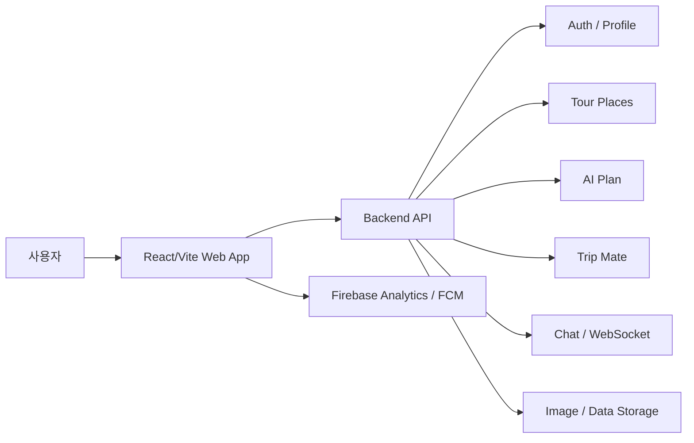

# Krip

### AI 기반 맞춤형 여행 일정 추천 및 여행 메이트 매칭 서비스

Krip은 사용자의 여행 취향, 위치, 동행 방식, 예산, 일정 조건을 기반으로 서울 중심의 관광지를 탐색하고 맞춤형 여행 일정을 설계할 수 있는 여행 플랫폼입니다.

사용자는 현재 위치 기반 관광지 검색, 즐겨찾기, AI 일정 생성, 수동 일정 작성, 여행 메이트 모집, 친구 관리, 실시간 채팅, 피드 공유 기능을 통해 여행 준비부터 동행자 소통까지 하나의 서비스 안에서 진행할 수 있습니다.

---

## 🔗 목차

- [💡 프로젝트 소개](#-프로젝트-소개)
- [📝 주요 기능](#-주요-기능)
- [🎬 시연 영상](#-시연-영상)
- [👋 팀원 소개](#-팀원-소개)
- [🌐 시스템 구조](#-시스템-구조)
- [🛠 기술 스택](#-기술-스택)
- [🚀 실행 방법](#-실행-방법)
- [📂 디렉토리 구조](#-디렉토리-구조)
- [📑 프로젝트 성과](#-프로젝트-성과)
- [📝 참고 자료](#-참고-자료)

---

## 💡 프로젝트 소개

| AI 기반 맞춤형 여행 일정 추천 및 여행 메이트 매칭 서비스 |
| --- |

Krip은 여행자가 자신의 취향과 조건에 맞는 관광지를 빠르게 탐색하고, 여행 일정을 구성하며, 함께 여행할 메이트를 찾을 수 있도록 지원하는 서비스입니다.

사용자는 위치 기반으로 주변 관광지를 확인하고, 카테고리·거리·평점·즐겨찾기 기준으로 장소를 탐색할 수 있습니다. 또한 여행 기간, 출발/도착 지역, 여행 스타일, 예산, 동행 유형, 음식 취향 등을 입력하여 개인화된 여행 계획을 만들 수 있습니다.

Krip은 단순한 관광지 목록 제공을 넘어 사용자 프로필과 선호도 기반의 여행 메이트 추천, 여행 모집 게시글, 친구 요청, 1:1 및 그룹 채팅, 푸시 알림을 제공하여 여행 전후의 커뮤니케이션까지 연결합니다.

---

## 📝 주요 기능

### 🗺️ 위치 기반 관광지 탐색

현재 위치 또는 기본 서울 위치를 기준으로 주변 관광지를 조회하고, 거리·평점·리뷰 수·즐겨찾기 기준으로 정렬할 수 있습니다.

### 🔍 관광지 검색 및 상세 정보 제공

관광지명, 키워드, 카테고리를 기반으로 장소를 검색하고 주소, 전화번호, 웹사이트, 영업시간, 편의시설, 결제 정보, 접근성, 리뷰 등 상세 정보를 확인할 수 있습니다.

### ⭐ 즐겨찾기 및 검색 기록 관리

관심 있는 관광지를 즐겨찾기에 저장하고, 사용자의 검색 기록을 기반으로 빠르게 다시 탐색할 수 있습니다.

### 🧠 AI 맞춤 여행 일정 생성

여행 기간, 출발지, 도착지, 일정 시간, 예산, 여행 스타일, 음식 취향, 선호 동행 유형, 추가 방문 장소 등을 입력해 개인화된 여행 일정을 생성합니다.

### 📝 수동 여행 일정 작성

AI 추천을 사용하지 않더라도 사용자가 직접 여행 일정을 구성하고 관리할 수 있습니다.

### 👥 여행 메이트 모집 게시판

지역, 여행 기간, 동행 유형, 선호 성별·연령대, 이미지 등을 포함한 여행 메이트 모집 글을 작성하고 검색할 수 있습니다.

### 🎯 선호도 기반 여행 메이트 추천

사용자의 여행 스타일, 식사 취향, 예산, 이동 방식, 소통 방식, 계획 성향 등을 바탕으로 잘 맞는 여행자를 추천합니다.

### 💬 친구 및 실시간 채팅

친구 검색, 친구 요청/수락/거절, 차단 관리와 함께 1:1 채팅 및 그룹 채팅을 제공합니다. WebSocket 기반 채팅 URL을 구성하여 실시간 메시지 흐름을 처리합니다.

### 🔔 Firebase 기반 알림

Firebase Cloud Messaging을 통해 foreground 메시지와 앱 내 토스트 알림을 제공하여 채팅, 친구, 서비스 이벤트를 사용자에게 전달합니다.

### 🧾 피드 및 공유 페이지

사용자 프로필, 피드 팝업, 공유된 여행 계획 페이지를 통해 여행 경험과 일정을 다른 사용자와 연결할 수 있습니다.

---

## 🎬 시연 영상

추가 예정

---

## 👋 팀원 소개

추가 예정

---

## 🌐 시스템 구조



---

## 🛠 기술 스택

### 💻 Frontend

| 역할 | 종류 |
| --- | --- |
| Programming Language | TypeScript |
| Library | React 19 |
| Build Tool | Vite |
| Routing | React Router DOM |
| Styling | CSS, CSS Variables |
| API Client | Fetch, Axios |
| Notification | Firebase Cloud Messaging |
| Analytics | Firebase Analytics |
| Formatting / Lint | ESLint |
| Package Manager | npm |
| Deployment Config | Vercel, Firebase |

### 💻 Backend

| 역할 | 종류 |
| --- | --- |
| Programming Language | Python 3.10 |
| Framework | FastAPI |
| ASGI / Realtime | python-socketio |
| Database Driver | asyncpg, psycopg2-binary |
| NoSQL / ODM | MongoDB, Motor, Beanie |
| Cache / Queue | Redis |
| Migration | Alembic |
| Scheduler | APScheduler |
| Auth / Security | PyJWT, Passlib Argon2 |
| HTTP Client | HTTPX |
| Test | pytest, pytest-asyncio, pytest-cov |
| Package Manager | uv |

### 🧠 AI / Data

| 역할 | 종류 |
| --- | --- |
| Deep Learning | PyTorch |
| Graph / Optimization | torch-geometric, OR-Tools |
| Data Processing | pandas, NumPy, scikit-learn |
| Visualization | matplotlib |
| Spreadsheet | openpyxl |

### 💻 Common

| 역할 | 종류 |
| --- | --- |
| Version Control | Git, GitHub |
| Frontend Hosting | Vercel / Firebase Hosting 설정 포함 |
| Environment | `.env.example` 기반 환경변수 관리 |

---

## 🚀 실행 방법

### 1. 소스 다운로드

```bash
git clone <repository-url>
cd Krip
```

### 2. 프론트엔드 실행

#### ① 환경 준비

- Node.js 20 이상 권장
- npm 설치

#### ② 환경변수 설정

`frontend/.env.example`을 참고하여 `frontend/.env` 또는 `frontend/.env.local` 파일을 생성합니다.

```env
VITE_API_BASE_URL=https://back.krip.site
VITE_AUTHORIZATION_BEARER=
VITE_TOUR_PLACES_AUTHORIZATION_BEARER=
VITE_AUTH_IS_LOCAL=false
VITE_KAKAO_JS_KEY=
VITE_LEGACY_TOKEN_STORAGE_KEY=
VITE_FIREBASE_API_KEY=
VITE_FIREBASE_AUTH_DOMAIN=
VITE_FIREBASE_PROJECT_ID=
VITE_FIREBASE_STORAGE_BUCKET=
VITE_FIREBASE_MESSAGING_SENDER_ID=
VITE_FIREBASE_APP_ID=
VITE_FIREBASE_MEASUREMENT_ID=
VITE_FIREBASE_VAPID_KEY=
```

#### ③ 실행 명령어

```bash
cd frontend
npm install
npm run dev
```

#### ④ 접속 주소

```text
http://localhost:5173
```

### 3. 프론트엔드 빌드

```bash
cd frontend
npm run build
npm run preview
```

### 4. 백엔드 실행

현재 저장소의 백엔드는 FastAPI 기반 프로젝트 구조와 의존성 설정이 포함되어 있습니다.

#### ① 환경 준비

- Python 3.10.20
- uv 설치

#### ② 의존성 설치

```bash
cd backend
uv sync
```

#### ③ 실행 예시

```bash
uv run fastapi dev app/main.py
```

> 백엔드 진입점과 API 구현 상태에 따라 실행 명령은 변경될 수 있습니다.

---

## 📂 디렉토리 구조

```text
📦 Krip
│
├── 📁 .github
│   └── PULL_REQUEST_TEMPLATE.md
│
├── 📁 frontend                         # 프론트엔드 (React + Vite)
│   ├── 📁 public                       # 정적 파일 및 Firebase Messaging SW
│   │   ├── default-profile.png
│   │   ├── default-profile.svg
│   │   ├── favicon.png
│   │   └── firebase-messaging-sw.js
│   │
│   ├── 📁 src
│   │   ├── App.tsx                     # 라우팅, 전역 토스트, FCM 초기화
│   │   ├── main.tsx                    # 앱 진입점
│   │   ├── index.css                   # 전역 스타일
│   │   │
│   │   ├── 📁 api                      # API 클라이언트 및 도메인별 요청 함수
│   │   │   ├── auth.ts
│   │   │   ├── chat.ts
│   │   │   ├── client.ts
│   │   │   ├── feed.ts
│   │   │   ├── friend.ts
│   │   │   ├── image.ts
│   │   │   ├── mate.ts
│   │   │   ├── notification.ts
│   │   │   ├── recommendation.ts
│   │   │   └── searchHistory.ts
│   │   │
│   │   ├── 📁 components               # 공통 UI 컴포넌트
│   │   │   ├── AppShell.tsx
│   │   │   ├── FeedPopup.tsx
│   │   │   └── NotificationBell.tsx
│   │   │
│   │   ├── 📁 features
│   │   │   ├── 📁 tour                 # 관광지 탐색 홈
│   │   │   ├── 📁 plan                 # AI/수동 여행 일정
│   │   │   ├── 📁 mate                 # 여행 메이트 모집/추천
│   │   │   └── 📁 friend-chat          # 친구/채팅 기능
│   │   │
│   │   ├── 📁 lib                      # Firebase, FCM, 알림 유틸
│   │   ├── 📁 pages                    # 로그인, 회원가입, 마이페이지 등 라우트 페이지
│   │   └── 📁 utils                    # 토스트, 토큰, 추천 로직 등 유틸
│   │
│   ├── .env.example                    # 프론트엔드 환경변수 예시
│   ├── firebase.json                   # Firebase Hosting 설정
│   ├── vercel.json                     # Vercel 설정
│   ├── package.json
│   ├── tsconfig.json
│   └── vite.config.ts
│
├── 📁 backend                          # 백엔드 (FastAPI 기반)
│   ├── 📁 app
│   │   ├── 📁 api
│   │   ├── 📁 config
│   │   ├── 📁 core
│   │   │   └── 📁 ai
│   │   ├── 📁 database
│   │   ├── 📁 domain
│   │   ├── 📁 middleware
│   │   ├── 📁 util
│   │   └── main.py
│   │
│   ├── pyproject.toml                  # Python 의존성 및 프로젝트 설정
│   ├── uv.lock
│   └── README.md
│
└── 📄 README.md                        # 프로젝트 전체 설명서
```

---

## 📑 프로젝트 성과

추가 예정

---

## 📝 참고 자료

- [React](https://react.dev/)
- [Vite](https://vite.dev/)
- [React Router](https://reactrouter.com/)
- [Firebase](https://firebase.google.com/)
- [FastAPI](https://fastapi.tiangolo.com/)
- [uv](https://docs.astral.sh/uv/)
